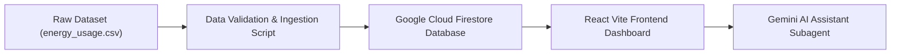

# 📘 Samsung SmartThings AI Energy Assistant - Database & Backend Documentation

This document serves as the official technical documentation for the data pipeline, IoT energy time-series dataset, column dictionary, Firestore architecture, end-to-end data flow, feature mapping, and execution instructions for the **Samsung SmartThings AI Energy Assistant**.

---

## 1. Project & Dataset Overview

- **Dataset Identifier**: `database/energy_usage.csv`
- **Target Location**: Chennai, Tamil Nadu, India
- **Climate Profile**: Hot and Humid Tropical (Daytime: 30°C–40°C, Nighttime: 27°C–31°C)
- **Household Identifier**: `HOUSE001` (2-Bedroom Apartment)
- **Occupants**: Family of 4 (Father - Office, Mother - WFH, College Student, School Student)
- **Monitored Structural Entities**: 6 Rooms (Living Room, Bedroom 1, Bedroom 2, Kitchen, Bathroom, Toilet)
- **Monitored IoT Devices**: 30 Appliances
- **Temporal Span**: 30 Consecutive Days (720 Hourly Timestamps per Appliance)
- **Total Records**: **21,600 Rows × 26 Columns**
- **Null Values**: 0 (Complete IoT Data Integrity)

---

## 2. Workspace & Directory Structure

```
samsung-project/
├── frontend/                     # React Vite Web Application
│   ├── src/                      # UI Components, Pages, Auth Hooks
│   ├── public/                   # Static Assets & Icons
│   ├── package.json              # Web Application Dependencies
│   └── .env                      # Production Firebase Web Credentials
│
└── database/                     # Backend Data & Analytics Engine
    ├── energy_usage.csv          # Raw 30-Day IoT Time-Series Dataset (21,600 Rows)
    ├── serviceAccountKey.json    # Firebase Admin SDK Credentials
    ├── firestore_schema.md       # Firestore NoSQL Database Schema & JSON Mappings
    ├── README.md                 # Official Database & Data Architecture Documentation
    └── notebooks/
        └── EDA.ipynb             # 15-Section Exploratory Data Analysis Notebook
```

### Purpose of Database Directory Items

| File / Folder | Purpose & Description |
|---|---|
| `database/energy_usage.csv` | Primary raw IoT dataset containing 21,600 hourly records across 30 appliances. |
| `database/serviceAccountKey.json` | Firebase Admin SDK private key for server-side Firestore operations. |
| `database/firestore_schema.md` | Detailed NoSQL schema specifications and sample document definitions. |
| `database/README.md` | Master reference documentation for dataset dictionary, data flow, and feature mappings. |
| `database/notebooks/EDA.ipynb` | Comprehensive 15-section analytical notebook with visualizations and insights. |

---

## 3. Complete Data Dictionary (26 Columns)

| Column Name | Datatype | Nullable | Example Value | Allowed / Expected Values & Description |
|---|---|---|---|---|
| `timestamp` | String (ISO 8601) | No | `2026-06-01T14:00:00Z` | Hourly UTC timestamp string formatted as `YYYY-MM-DDTHH:MM:SSZ`. |
| `date` | String | No | `2026-06-01` | Calendar date string formatted as `YYYY-MM-DD`. |
| `hour` | Integer | No | `14` | Hour index ranging from `0` to `23`. |
| `day_of_week` | String | No | `Monday` | Name of weekday (`Monday` through `Sunday`). |
| `is_weekend` | Boolean / String | No | `FALSE` | `TRUE` if day is Saturday or Sunday, else `FALSE`. |
| `house_id` | String | No | `HOUSE001` | Unique household entity identifier. |
| `room_id` | String | No | `ROOM001` | Unique structural room ID (`ROOM001` to `ROOM006`). |
| `room_name` | String | No | `Living Room` | Human-readable room title. |
| `room_type` | String | No | `living_room` | Categorical key (`living_room`, `bedroom`, `kitchen`, `bathroom`, `toilet`). |
| `appliance_id` | String | No | `LR_AC_001` | Unique IoT hardware appliance ID across the 30 monitored devices. |
| `appliance_name` | String | No | `Samsung WindFree AC` | Display name of the smart appliance. |
| `appliance_type` | String | No | `ac` | Appliance category (`ac`, `tv`, `fan`, `light`, `fridge`, `geyser`, etc.). |
| `manufacturer` | String | No | `Samsung` | Brand manufacturer (`Samsung`, `Philips`, `Havells`, `Crompton`, etc.). |
| `rated_power_watts` | Integer | No | `1500` | Hardware electrical power rating in Watts (`8` to `2000`). |
| `status` | String | No | `ON` | Operating state (`ON` or `OFF`). |
| `runtime_minutes` | Integer | No | `45` | Total active minutes during the hourly window (`0` to `60`). |
| `power_consumption_wh` | Float | No | `1125.0` | Active energy draw in Watt-hours (`rated_power_watts * (runtime_minutes / 60)`). |
| `energy_kwh` | Float | No | `1.125` | Active energy draw converted to kWh (`power_consumption_wh / 1000`). |
| `electricity_cost` | Float | No | `7.88` | Monetary billing cost in INR (`energy_kwh * 7.00`). |
| `occupancy` | Boolean / String | No | `TRUE` | Room motion sensor state (`TRUE` if occupied, `FALSE` if vacant). |
| `ambient_temperature` | Float | No | `36.4` | Outdoor ambient temperature in Celsius (`27.0°C` to `40.0°C`). |
| `weather` | String | No | `Hot` | Outdoor climate state (`Sunny`, `Hot`, `Cloudy`, `Rainy`). |
| `tariff_type` | String | No | `TNEB Domestic` | Utility billing tariff classification (`TNEB Domestic`). |
| `daily_limit_kwh` | Float | No | `6.0` | Recommended daily energy budget limit for this specific appliance. |
| `threshold_exceeded` | Boolean / String | No | `FALSE` | `TRUE` if cumulative daily kWh exceeds `daily_limit_kwh`, else `FALSE`. |
| `ai_flag` | String | No | `Normal` | Diagnostic classification (`Normal`, `Idle Device Left ON`, `High Usage`, `High Night Consumption`, `No Occupancy Detected`, `Threshold Exceeded`). |

---

## 4. Entity Relationship Hierarchy

```
House (HOUSE001)
 └── Rooms (ROOM001 – ROOM006)
      └── Appliances (30 Smart Things Devices)
           └── Hourly Energy Records (21,600 Rows)
```

---

## 5. End-to-End System Data Flow



1. **Raw Ingestion**: Time-series telemetry generated from smart appliances is formatted into `energy_usage.csv`.
2. **Validation & Preprocessing**: `EDA.ipynb` and python scripts validate missing values, ensure zero-draw integrity when `status == OFF`, and compute financial metrics.
3. **Firestore Synchronization**: Transformed records are persisted into Cloud Firestore under `houses/{houseId}/energy_logs`.
4. **React Dashboard Visualization**: `AuthContext` and React components query real-time Firestore collections to render live metrics, room load pie charts, and energy alert badges.
5. **Gemini AI Recommendation**: Gemini subagent analyzes `ai_flag` anomalies, energy trends, and outdoor climate to output context-aware energy-saving alerts.

---

## 6. Feature Matrix & Usage Scope

| Feature / Column Name | React Dashboard UI | Firebase / Firestore | Gemini AI Subagent | Data Analytics & EDA |
|---|:---:|:---:|:---:|:---:|
| `timestamp` / `date` / `hour` | ✅ | ✅ | ✅ | ✅ |
| `house_id` / `room_id` / `appliance_id` | ✅ | ✅ | ✅ | ✅ |
| `room_name` / `appliance_name` | ✅ | ✅ | ✅ | ✅ |
| `rated_power_watts` / `status` | ✅ | ✅ | ❌ | ✅ |
| `runtime_minutes` | ✅ | ✅ | ✅ | ✅ |
| `power_consumption_wh` / `energy_kwh` | ✅ | ✅ | ✅ | ✅ |
| `electricity_cost` | ✅ | ✅ | ✅ | ✅ |
| `occupancy` | ✅ | ✅ | ✅ | ✅ |
| `ambient_temperature` / `weather` | ✅ | ✅ | ✅ | ✅ |
| `daily_limit_kwh` / `threshold_exceeded` | ✅ | ✅ | ✅ | ✅ |
| `ai_flag` | ✅ | ✅ | ✅ | ✅ |

---

## 7. Python Environment & Script Execution Instructions

### Required Python Libraries
To run the analysis notebooks and data processing tools, ensure the following packages are installed:

```bash
pip3 install pandas matplotlib seaborn numpy
```

### Executing the Exploratory Data Analysis (EDA)
To run or inspect the complete 15-section analysis:

1. Open VS Code or Jupyter Server.
2. Open `database/notebooks/EDA.ipynb`.
3. Select the Python kernel (`/opt/homebrew/bin/python3` or standard Python environment).
4. Run all cells (`Run All`).

Alternatively, execute programmatically via command line:
```bash
python3 -c "import pandas as pd; df = pd.read_csv('database/energy_usage.csv'); print(df.info())"
```
