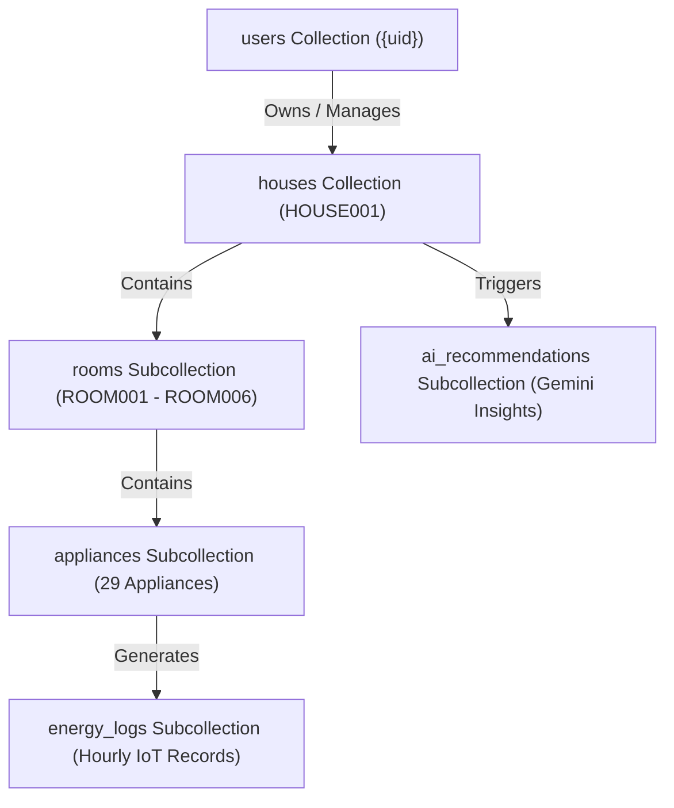

# 🔥 Firestore Database Architecture & Schema Documentation

This document defines the official Google Cloud Firestore NoSQL schema, collection hierarchy, mapping rules, and document JSON structures for the **Samsung SmartThings AI Energy Assistant**.

---

## 1. Relational Entity Hierarchy



---

## 2. Recommended Firestore Collections

### Collection 1: `users` (User Profiles)
Stores authenticated user account metadata linked via Firebase Authentication (`uid`).

- **Document ID**: `{uid}` (Firebase Auth User Unique Identifier)

```json
{
  "uid": "aB3kL9pZ2xM5nQ1vW8rT4yU7iO0e",
  "name": "Nishant Kumar",
  "email": "nishant.smartthings@samsung.com",
  "photoURL": "https://images.unsplash.com/photo-1535713875002-d1d0cf377fde?auto=format&fit=crop&q=80&w=200",
  "houseName": "Smart Villa Chennai",
  "houseLocation": "Chennai, Tamil Nadu, India",
  "createdAt": "2026-06-01T00:00:00.000Z",
  "updatedAt": "2026-07-15T22:30:00.000Z"
}
```

---

### Collection 2: `houses` (Households)
Stores household structural metadata, climate settings, and occupants summary.

- **Document ID**: `HOUSE001`

```json
{
  "houseId": "HOUSE001",
  "ownerUid": "aB3kL9pZ2xM5nQ1vW8rT4yU7iO0e",
  "houseName": "Smart Villa Chennai",
  "location": "Chennai, Tamil Nadu, India",
  "climate": "Hot and Humid Tropical",
  "totalRooms": 6,
  "totalAppliances": 30,
  "familySize": 4,
  "occupantsSummary": "Father (Office), Mother (WFH), College Student, School Student",
  "tariffType": "TNEB Domestic",
  "tariffRatePerKwh": 7.00,
  "monthlyBudgetKwh": 1400.00,
  "createdAt": "2026-06-01T00:00:00.000Z"
}
```

---

### Subcollection 3: `houses/{houseId}/rooms` (Room Structural Entities)
Stores room metadata.

- **Document Path**: `houses/HOUSE001/rooms/{roomId}` (e.g. `ROOM001`)

```json
{
  "roomId": "ROOM001",
  "houseId": "HOUSE001",
  "roomName": "Living Room",
  "roomType": "living_room",
  "applianceCount": 6,
  "createdAt": "2026-06-01T00:00:00.000Z"
}
```

---

### Subcollection 4: `houses/{houseId}/appliances` (Smart Appliances)
Stores device specifications, rated power, manufacturer, and daily energy quotas.

- **Document Path**: `houses/HOUSE001/appliances/{applianceId}` (e.g. `LR_AC_001`)

```json
{
  "applianceId": "LR_AC_001",
  "applianceName": "Samsung WindFree AC",
  "applianceType": "ac",
  "roomId": "ROOM001",
  "roomName": "Living Room",
  "manufacturer": "Samsung",
  "ratedPowerWatts": 1500,
  "dailyLimitKwh": 6.00,
  "currentStatus": "OFF",
  "isSmartThingsConnected": true,
  "createdAt": "2026-06-01T00:00:00.000Z"
}
```

---

### Subcollection 5: `houses/{houseId}/energy_logs` (Hourly Time-Series Records)
Stores hourly time-series readings imported from `energy_usage.csv`.

- **Document Path**: `houses/HOUSE001/energy_logs/{logId}`
- **Document ID Format**: `{applianceId}_{timestamp}` (e.g., `LR_AC_001_2026-06-01T14:00:00Z`)

```json
{
  "logId": "LR_AC_001_2026-06-01T14:00:00Z",
  "applianceId": "LR_AC_001",
  "applianceName": "Samsung WindFree AC",
  "applianceType": "ac",
  "roomId": "ROOM001",
  "roomName": "Living Room",
  "roomType": "living_room",
  "houseId": "HOUSE001",
  "timestamp": "2026-06-01T14:00:00.000Z",
  "date": "2026-06-01",
  "hour": 14,
  "dayOfWeek": "Monday",
  "isWeekend": false,
  "status": "ON",
  "runtimeMinutes": 50,
  "powerConsumptionWh": 1250.00,
  "energyKwh": 1.2500,
  "electricityCost": 8.75,
  "occupancy": true,
  "ambientTemperature": 36.4,
  "weather": "Hot",
  "tariffType": "TNEB Domestic",
  "dailyLimitKwh": 6.00,
  "thresholdExceeded": false,
  "aiFlag": "Normal"
}
```

---

### Subcollection 6: `houses/{houseId}/ai_recommendations` (Gemini Assistant Advice)
Stores AI-generated recommendations based on anomaly flags.

- **Document Path**: `houses/HOUSE001/ai_recommendations/{recId}`

```json
{
  "recId": "REC_ANOMALY_004_15",
  "houseId": "HOUSE001",
  "applianceId": "BATH_GEYSER_001",
  "applianceName": "Water Heater",
  "roomId": "ROOM005",
  "roomName": "Bathroom",
  "anomalyType": "High Usage",
  "detectedAt": "2026-06-15T09:00:00.000Z",
  "wastedEnergyKwh": 10.0,
  "estimatedWastedCost": 70.00,
  "severity": "HIGH",
  "recommendationTitle": "Continuous Geyser Operation Detected",
  "recommendationMessage": "Geyser ran continuously for 5 hours. Turn off immediately to save up to ₹70 today.",
  "status": "ACTIVE"
}
```

---

## 3. CSV Row to Firestore Field Mapping Table

| CSV Header Column | Target Firestore Field | Target Datatype | Description & Transformation |
|---|---|---|---|
| `timestamp` | `timestamp` | `Timestamp` / `String (ISO 8601)` | Standardized UTC timestamp |
| `date` | `date` | `String (YYYY-MM-DD)` | Calendar date string |
| `hour` | `hour` | `Number (Integer)` | Hour index `0..23` |
| `day_of_week` | `dayOfWeek` | `String` | Day name (e.g. `Monday`) |
| `is_weekend` | `isWeekend` | `Boolean` | Parsed from `TRUE`/`FALSE` string |
| `house_id` | `houseId` | `String` | Foreign key reference `HOUSE001` |
| `room_id` | `roomId` | `String` | Foreign key reference (e.g. `ROOM001`) |
| `room_name` | `roomName` | `String` | Display room title (e.g. `Living Room`) |
| `room_type` | `roomType` | `String` | Categorical key (e.g. `living_room`) |
| `appliance_id` | `applianceId` | `String` | Unique hardware ID (e.g. `LR_AC_001`) |
| `appliance_name` | `applianceName` | `String` | Clean appliance name |
| `appliance_type` | `applianceType` | `String` | Categorical type (`ac`, `tv`, etc.) |
| `manufacturer` | `manufacturer` | `String` | Brand name (`Samsung`, `Philips`) |
| `rated_power_watts`| `ratedPowerWatts` | `Number (Float)` | Electrical rating in Watts |
| `status` | `status` | `String` | Device status (`ON` / `OFF`) |
| `runtime_minutes` | `runtimeMinutes` | `Number (Integer)` | Active minutes in hour (`0..60`) |
| `power_consumption_wh`| `powerConsumptionWh` | `Number (Float)` | Active energy draw in Watt-hours |
| `energy_kwh` | `energyKwh` | `Number (Float)` | Energy draw in kWh (`Wh / 1000`) |
| `electricity_cost` | `electricityCost` | `Number (Float)` | Calculated cost in INR (₹) |
| `occupancy` | `occupancy` | `Boolean` | Room motion sensor state |
| `ambient_temperature`| `ambientTemperature`| `Number (Float)` | Outdoor ambient heat (°C) |
| `weather` | `weather` | `String` | Climate state (`Sunny`, `Hot`, etc.) |
| `tariff_type` | `tariffType` | `String` | Billing category (`TNEB Domestic`) |
| `daily_limit_kwh` | `dailyLimitKwh` | `Number (Float)` | Daily energy budget ceiling |
| `threshold_exceeded`| `thresholdExceeded` | `Boolean` | Flag indicating quota breach |
| `ai_flag` | `aiFlag` | `String` | Diagnostic label for Gemini AI |
